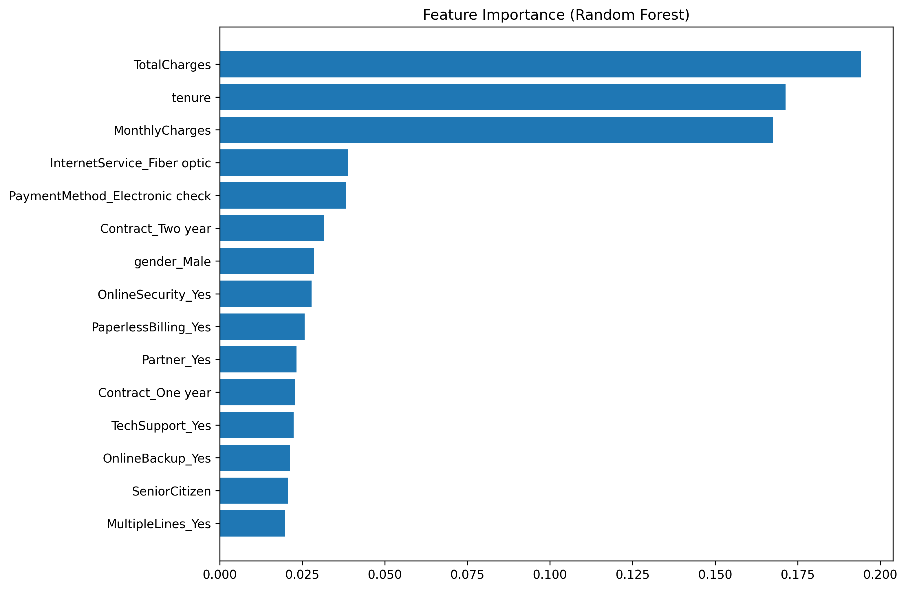

# 🔮 Customer Churn Prediction System

A machine learning project built as part of the FutureInterns Machine Learning Internship to predict customer churn for a telecom company using classification models, feature engineering, and data visualization.


---

## 📌 Project Overview

The goal of this project is to analyze customer behavior and predict whether a customer is likely to discontinue the service (churn).
A machine learning model was developed using logistic regression and random forest algorithms, and the final output includes:

Churn prediction model

Churn probability scores

Feature importance analysis

Exported dataset for Power BI dashboard

Business recommendations


---

## 📁 Project Structure

```.md
Churn-Prediction-System/
│
├── data/
│   └── raw/
│       └── WA_Fn-UseC_-Telco-Customer-Churn.csv
│
├── notebooks/
│   └── 01_churn_modeling.ipynb
│
├── reports/
│   ├── churn_predictions.csv
│   └── business_recommendations.md
│
├── src/
│   └── (future scripts can be added here)
│
└── README.md
```

---

## 🛠 Tools & Technologies Used

Python

Pandas

NumPy

Matplotlib

Scikit-learn


Power BI (for dashboard)

VS Code (development environment)

Git & GitHub (version control)


---

## 🔍 Key Steps in the Project

### 1. Data Preprocessing

Removed customerID

Converted TotalCharges from object → numeric

Handled missing values

Mapped churn (Yes/No → 1/0)

One-hot encoded all categorical features


### 2. Exploratory Data Analysis

Dataset info & summary statistics

Churn distribution

Feature correlations & trends


### 3. Model Training

Two models were trained and evaluated:

Logistic Regression

Accuracy: ~80%

ROC AUC: ~0.84


Random Forest

Accuracy: ~79%

ROC AUC: ~0.82


Logistic Regression performed slightly better on this dataset.


---

## 📈 Feature Importance Insights (Random Forest)

Top factors influencing churn include:

1. TotalCharges


2. Tenure


3. MonthlyCharges


4. InternetService (Fiber Optic)


5. Contract Type


6. Online Security


7. Payment Method


These insights helped shape the business recommendations.


---

## 📤 Model Output for Power BI

A CSV file containing churn predictions and churn probabilities was exported:

```.md
reports/churn_predictions.csv
```

This file can be directly imported into Power BI to build a dashboard with:

High-risk customer segments

Actual vs predicted churn

Churn probability distribution


---

## 📝 Business Recommendations

A detailed analysis with recommendations (pricing, customer retention, contract management, service enhancements) can be found in:

```.md
reports/business_recommendations.md
```

---

## 🛠 How to Run This Project Locally

If someone wants to run the model on their own system:

```.md
# 1. Clone the repository
git clone https://github.com/ViditKumar999/FUTURE_ML_02

# 2. Navigate into the project directory
cd FUTURE_ML_02

# 3. Install dependencies
pip install -r requirements.txt  (optional)

# 4. Open the notebook
jupyter notebook notebooks/01_churn_modeling.ipynb
```

---

## 📊 Sample Visualizations

### Feature Importance Plot





---

## 🎯 Conclusion

This project successfully predicts customer churn with strong performance metrics and provides meaningful business insights to help the organization reduce churn and improve customer retention.


---

## 📬 Contact

If you have any questions, feedback, or collaboration ideas, feel free to reach out:

### Vidit Kumar

#### Email: vidit.kumar624@gmail.com

#### LinkedIn: linkedin.com/in/viditkumar-in

#### GitHub: https://github.com/Vidit3859

I’d love to connect!


---
